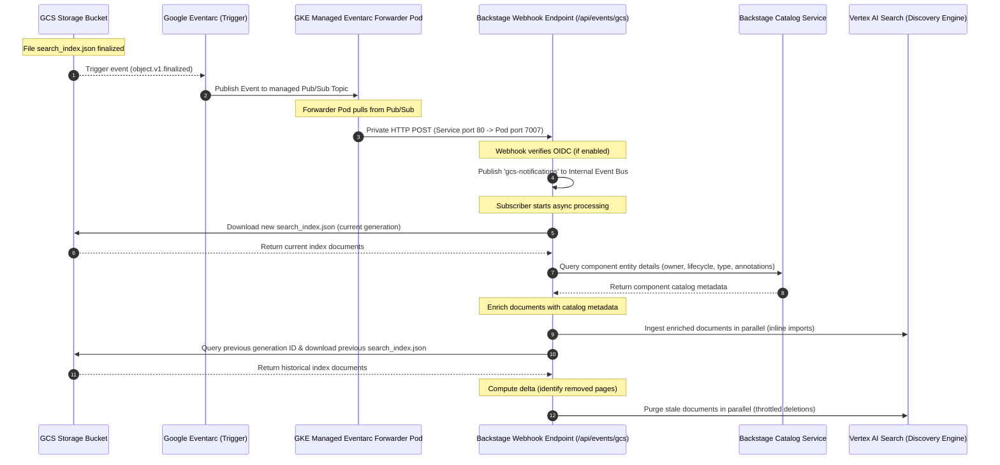

# GCS Eventarc TechDocs Ingress Backend Module for Backstage (`@backstage-community/plugin-events-backend-module-gcs-eventarc`)

This custom backend module implements a webhook ingress point that listens to Google Cloud Storage (GCS) object finalize events via Google Eventarc, automatically triggering incremental ingestion of **TechDocs** search indices into Google Vertex AI Search.

---

## ⚡ Ingestion Workflow



---

## 🔌 Webhook Endpoint: `/api/events/gcs`

Exposes a webhook endpoint mounted on the events router.

- **Event Type**: Listens for `google.cloud.storage.object.v1.finalized` events (sent automatically when a file is created or updated in GCS).
- **Payload**: Receives the GCS file metadata (bucket name, file path, and generation ID) to identify the changed asset.

---

## 🔐 Authentication & Webhook Security

To prevent spoofing or unauthorized ingestion, the `/api/events/gcs` webhook supports **Google OIDC ID Token verification** (which can be enabled or disabled in your configuration):

When enabled:

1.  The webhook intercepts requests and extracts the `Authorization: Bearer <ID_TOKEN>` header.
2.  Using Google's library (`google-auth-library`), it verifies:
    - **Signature & Validity**: The token is valid and cryptographically signed by Google.
    - **Issuer**: Must match `https://accounts.google.com`.
    - **Audience**: Matches the Backstage base path: `${baseUrl}/api/events/gcs`.
    - **Service Account Verification**: If configured, it ensures the token belongs exclusively to the expected GKE/Eventarc service account email (`events.modules.gcsEventarcWebhook.oidc.serviceAccountEmail`).

---

## 🌐 GKE Internal Routing & Constraints

When an Eventarc trigger is configured with a GKE Service destination, Eventarc delivers events privately and internally directly to your Kubernetes Service within the GKE cluster:

1. Google's Eventarc agent automatically provisions a dedicated namespace `eventarc-<trigger-name>-<hash>` and deploys a managed **`gke-forwarder`** pod inside it.
2. The forwarder pod privately subscribes to Eventarc's Google-managed Pub/Sub topic, pulls events, and posts them **internally** inside the VPC network directly to your GKE service: `http://backstage.backstage.svc.cluster.local/api/events/gcs`.

> [!IMPORTANT] > **The Port 80 Constraint**: The GKE destination block for GCP Eventarc strictly routes events to port `80` and does not accept custom target port configurations. To support this, you **must** expose port `80` (Service port) in your Backstage Kubernetes Service configuration and map it to your container's port `7007` (Pod port) (see the Kubernetes configuration below).

> [!WARNING] > **Google OIDC Configuration in GKE**:
> Google OIDC ID Token verification is fully implemented in the module and can be enabled or disabled in configuration (`events.modules.gcsEventarcWebhook.oidc.enabled`). However, it **must** be disabled (`false`) when using GKE private routing.
>
> **The Reason**: Google Eventarc only generates and attaches Google OIDC ID tokens when delivering to public HTTPS endpoints, Cloud Run, or Cloud Functions. For GKE service destinations, Eventarc uses an internal cluster-local **gke-forwarder** pod that pulls from Pub/Sub and makes a direct HTTP POST request to your service. Because this forwarder pod runs locally within your VPC and cannot generate or attach Google OIDC ID tokens, the webhook will reject Eventarc requests if OIDC verification is enabled. Security for GKE internal endpoints should instead be handled at the network level (e.g., using Kubernetes `NetworkPolicies`).

> [!NOTE] > **Why the OIDC Verification Code is Retained**:
> Despite being disabled for GKE internal VPC routing, the OIDC token verification logic is fully supported and retained in the codebase to support:
>
> - **Public Cloud Run / Serverless Deployments**: If Backstage is deployed on Google Cloud Run or App Engine (where the endpoint is exposed as a public HTTPS URL), enabling OIDC is **highly recommended** (and often mandatory) to cryptographically verify that all incoming webhooks originate genuinely from your Google Cloud Eventarc trigger, preventing public index spoofing.
> - **Future-Proofing**: If the GKE Eventarc forwarder introduces support for token forwarding in the future, verification can be turned back on instantly via a config change (`enabled: true`) without requiring code modifications.

---

## 🛡️ Securing the Webhook Endpoint at the Network Level

Because Google OIDC token validation must be disabled when using private GKE Eventarc routing, the webhook endpoint `/api/events/gcs` is exposed without application-level authentication.

To prevent spoofing or unauthorized ingestion attempts, you **must** block external access to this path at the network/ingress layer. Here are the three main ways to enforce this in common environments:

### 1. NGINX Ingress Controller (Path Blocking)

If you use NGINX Ingress, you can return a `403 Forbidden` response for the `/api/events/gcs` path at the ingress level:

```yaml
apiVersion: networking.k8s.io/v1
kind: Ingress
metadata:
  name: backstage-ingress
  namespace: backstage
  annotations:
    nginx.ingress.kubernetes.io/configuration-snippet: |
      location /api/events/gcs {
        deny all;
        return 403;
      }
spec:
  # ... standard ingress spec ...
```

---

### 2. GKE Gateway API with Google Cloud Armor (Edge 403 Blocking)

For the most robust protection, you can drop requests at the Google Cloud Load Balancer edge with a `403 Forbidden` using a Cloud Armor policy.

1. **Create the Cloud Armor Security Policy in GCP**:

   ```bash
   gcloud compute security-policies create backstage-armor-policy
   gcloud compute security-policies rules create 1000 \
       --security-policy=backstage-armor-policy \
       --expression="request.path.matches('/api/events/gcs')" \
       --action="deny-403"
   ```

2. **Bind the Policy to GKE Backend using a `GCPBackendPolicy`**:
   ```yaml
   apiVersion: networking.gke.io/v1
   kind: GCPBackendPolicy
   metadata:
     name: backstage-security-policy
     namespace: backstage
   spec:
     default:
       securityPolicy: backstage-armor-policy
     targetRef:
       group: ''
       kind: Service
       name: backstage
   ```

---

### 3. GKE Gateway API (URL Rewrite to 404)

Alternatively, you can use GKE Gateway's `URLRewrite` filter to rewrite requests targeting `/api/events/gcs` to a non-existent path before sending them to Backstage. When Backstage receives this rewritten route, it will automatically return a `404 Not Found`:

```yaml
apiVersion: gateway.networking.k8s.io/v1
kind: HTTPRoute
metadata:
  name: backstage-route
  namespace: backstage
spec:
  parentRefs:
    - group: gateway.networking.k8s.io
      kind: Gateway
      name: external-http-gateway
  rules:
    # Match the webhook path, rewrite it to an invalid path, and send to Backstage
    - matches:
        - path:
            type: PathPrefix
            value: /api/events/gcs
      filters:
        - type: URLRewrite
          urlRewrite:
            path:
              type: ReplaceFullPath
              replaceFullPath: /invalid-blocked-route
      backendRefs:
        - name: backstage
          port: 7007
    # Route all other Backstage traffic normally
    - matches:
        - path:
            type: PathPrefix
            value: /
      backendRefs:
        - name: backstage
          port: 7007
```

---

### 4. Kubernetes `NetworkPolicy` (Internal VPC Isolation)

In addition to Gateway-level blocks, you should apply a `NetworkPolicy` to ensure port `80` (the GKE Eventarc forwarder destination) is isolated and can only receive requests from Eventarc's managed namespaces:

```yaml
apiVersion: networking.k8s.io/v1
kind: NetworkPolicy
metadata:
  name: restrict-webhook-to-eventarc-only
  namespace: backstage
spec:
  podSelector:
    matchLabels:
      app: backstage
  policyTypes:
    - Ingress
  ingress:
    # Allow internal Eventarc forwarders on port 80
    - from:
        - namespaceSelector:
            matchExpressions:
              - key: kubernetes.io/metadata.name
                operator: In
                values: ['eventarc-xxxx'] # Replace with your dynamic Eventarc namespace name
      ports:
        - protocol: TCP
          port: 80
    # Allow standard ingress/gateway traffic on port 7007
    - ports:
        - protocol: TCP
          port: 7007
```

---

## 🔄 Ingestion, Enrichment & Reconciliation

1.  **Catalog Metadata Enrichment**: When a GCS notification arrives, the webhook resolves the matching component entity in the Backstage Software Catalog (using the `CatalogService`). It extracts core catalog fields:
    - `owner` (entity's `spec.owner`)
    - `lifecycle` (entity's `spec.lifecycle`)
    - `componentType` (entity's `spec.type`)
    - `annotations` (entity's `metadata.annotations`)
      These fields are merged into each page's search document payload, enabling robust faceted filtering on the search frontend.
2.  **Stable ID Mapping**: Documents are mapped to stable, deterministic **MD5-hashed IDs** generated from namespace, kind, name, and page path.
3.  **Delta Comparison**: The webhook reads the **immediately previous generation** of `search_index.json` from GCS versioning history.
4.  **Reconciliation**: It compares the previous list of document IDs against the new generation to calculate which pages were deleted, and purges those stale document IDs from Vertex AI Search to keep the index in sync with GCS.

---

## 🔌 Installation

First, install the package in your Backstage backend package:

```bash
yarn --cwd packages/backend add @backstage-community/plugin-events-backend-module-gcs-eventarc
```

Then, add it to your `packages/backend/src/index.ts` alongside any other plugins/modules:

```typescript
// packages/backend/src/index.ts
import { createBackend } from '@backstage/backend-defaults';

const backend = createBackend();

// ... other plugins ...

backend.add(
  import('@backstage-community/plugin-events-backend-module-gcs-eventarc'),
);

backend.start();
```

---

## 📦 Kubernetes Service Mapping

To route private Eventarc traffic (port 80) and standard developer traffic (port 7007) to the Backstage container:

```yaml
apiVersion: v1
kind: Service
metadata:
  name: backstage
  namespace: backstage
spec:
  type: ClusterIP
  ports:
    - port: 7007
      targetPort: http
      protocol: TCP
      name: http
    - port: 80
      targetPort: http
      protocol: TCP
      name: eventarc # Map port 80 for internal GKE Eventarc Forwarder routing
  selector:
    app: backstage
```

---

## ⚙️ Configuration

Configure the GCS Eventarc webhook and its dependent Vertex AI Search engine in your `app-config.yaml` as follows:

> [!IMPORTANT] > **Conflict with Local Indexing**:
> This webhook module **cannot** be active when direct local indexing is enabled for TechDocs (`search.engines.vertexai.types.techdocs.indexing.enabled: true` or globally `search.engines.vertexai.indexing.enabled: true`).
> If both are enabled, the backend will fail to start and throw a `BackendStartupError` during initialization. You must either disable local techdocs indexing in configuration or remove the webhook module (`eventsModuleGcsEventarcWebhook`) from your backend codebase.

```yaml
# 1. Webhook Ingress Configuration
events:
  modules:
    gcsEventarcWebhook:
      oidc:
        enabled: true # Set to false in GKE environments, true for public/development routes
        audience: ${baseUrl}/api/events/gcs
        serviceAccountEmail: ${gcpServiceAccount}
      # Optional tuning parameters:
      maxConcurrency: 5 # Maximum concurrent deletion or import operations (default: 5)
      payloadSizeLimit: '100kb' # Express body size limit for webhook payload (default: '100kb')
      batchSize: 100 # Maximum documents per inline import request (default: 100, max: 100)

# 2. Dependent Vertex AI Search Engine Configuration (Required for Sync)
search:
  engines:
    vertexai:
      types:
        techdocs:
          datastore:
            projectId: your-gcp-project-id
            datastoreId: your-techdocs-datastore-id
            location: global # GCP region of your datastore (e.g., 'global', 'europe-west4')
```

---

## 🛠️ Local Development & Testing

You can easily test the webhook and document synchronization locally without provisioning Google Eventarc triggers or GKE infrastructure.

### 1. Prerequisites

Ensure you have authenticated your local terminal with Google Cloud Application Default Credentials (ADC) so Backstage can access GCS and Vertex AI Search on your behalf:

```bash
gcloud auth application-default login
```

### 2. Configure Local Backstage

In your local `app-config.local.yaml`, disable OIDC verification so you can send unauthenticated test payloads, and verify your Vertex AI Datastore configuration is correct:

```yaml
events:
  modules:
    gcsEventarcWebhook:
      oidc:
        enabled: false # Disable signature checks for local testing
```

### 3. Simulate an Eventarc Notification

Start your Backstage backend locally (`yarn start`). Once it is running on `http://localhost:7007`, trigger a mock GCS Eventarc notification using `curl`.

Replace `your-techdocs-bucket` with your actual GCS bucket name, and ensure the path points to an existing `search_index.json` in your bucket:

```bash
curl -X POST http://localhost:7007/api/events/gcs \
  -H "Content-Type: application/json" \
  -H "ce-type: google.cloud.storage.object.v1.finalized" \
  -d '{
    "bucket": "your-techdocs-bucket",
    "name": "default/component/your-component/search_index.json",
    "generation": 100001
  }'
```

### 4. Verify Ingestion

Check your local Backstage console logs. You should see output indicating that the webhook successfully intercepted the GCS event, resolved the catalog component, downloaded `search_index.json`, mapped the pages, and synchronized them:

```text
[1] info: Starting search-index synchronization for: default/component/your-component/search_index.json
[1] info: Ingesting 12 pages into dataStore: your-techdocs-datastore-id by spawning 1 import operations (concurrency limit: 5)...
[1] info: Waiting for all 1 import operations to complete in parallel...
[1] info: Bulk document ingestion completed.
[1] info: Successfully synchronized search index for Component:default/your-component
```

---

## 🛠️ Infrastructure Provisioning (Terraform)

### 🔑 Required Google Cloud APIs

Before provisioning, ensure the following service APIs are enabled on your GCP project:

- **`eventarc.googleapis.com`** (Eventarc API)
- **`eventarcpublishing.googleapis.com`** (Eventarc Publishing API, required for custom event delivery)
- **`container.googleapis.com`** (Kubernetes Engine API, required to discover and route GKE destinations)
- **`run.googleapis.com`** (Cloud Run Admin API, required for Cloud Run destinations)
- **`cloudresourcemanager.googleapis.com`** (Cloud Resource Manager API, required for IAM policy configuration)

To set up the Eventarc trigger in Google Cloud:

#### Option A: GKE Destination (Internal VPC Routing)

Use this if Backstage is running inside a GKE cluster:

```hcl
resource "google_eventarc_trigger" "gcs_to_backstage_gke" {
  name     = "gcs-to-backstage-gke"
  location = "europe-west1" # Replace with your cluster region
  project  = var.project_id

  matching_criteria {
    attribute = "type"
    value     = "google.cloud.storage.object.v1.finalized"
  }

  matching_criteria {
    attribute = "bucket"
    value     = var.techdocs_bucket_name
  }

  destination {
    gke {
      cluster   = var.gke_cluster_name
      location  = var.gke_cluster_location
      namespace = "backstage"
      service   = "backstage"
      path      = "/api/events/gcs"
    }
  }

  service_account = google_service_account.eventarc_trigger_sa.email
}
```

#### Option B: Cloud Run Destination (Public HTTPS / Serverless)

Use this if Backstage is running on Google Cloud Run:

```hcl
resource "google_eventarc_trigger" "gcs_to_backstage_run" {
  name     = "gcs-to-backstage-run"
  location = "europe-west1" # Replace with your Cloud Run region
  project  = var.project_id

  matching_criteria {
    attribute = "type"
    value     = "google.cloud.storage.object.v1.finalized"
  }

  matching_criteria {
    attribute = "bucket"
    value     = var.techdocs_bucket_name
  }

  destination {
    cloud_run_service {
      service = "backstage"
      region  = "europe-west1"
      path    = "/api/events/gcs"
    }
  }

  service_account = google_service_account.eventarc_trigger_sa.email
}
```

> [!IMPORTANT] > **Required GCP Service Accounts & IAM Roles**:
> Configure the following GCP IAM permissions based on your chosen deployment target:
>
> 1. **Eventarc Trigger Service Account** (`google_service_account.eventarc_trigger_sa.email`):
>
>    - **`roles/eventarc.eventReceiver`** on the trigger resource.
>    - **`roles/run.invoker`** on the destination Cloud Run service (only required for **Cloud Run** destinations).
>
> 2. **GCS Service Agent** (`service-<project-number>@gs-project-accounts.iam.gserviceaccount.com`):
>
>    - **`roles/pubsub.publisher`** on the GCP project (allows GCS to publish file events to Eventarc's Pub/Sub topics).
>
> 3. **Eventarc Service Agent** (`service-${data.google_project.project.number}@gcp-sa-eventarc.iam.gserviceaccount.com`):
>    - **`roles/compute.viewer`** on the GCP project (only required for **GKE** destinations to query cluster metadata).
>    - **`roles/container.developer`** on the GKE cluster (only required for **GKE** destinations to deploy GKE forwarders).
>    - **`roles/iam.serviceAccountAdmin`** on the Eventarc Trigger Service Account (only required for **GKE** destinations to link the SA to GKE forwarders).

### Customer-Managed Encryption Keys (CMEK) Support

If your organization enforces an organizational policy requiring Customer-Managed Encryption Keys (KMS) for Pub/Sub topics, you must configure Eventarc to use a KMS key when creating its underlying Pub/Sub topics.

Add the following to your Terraform configuration:

```hcl
# Configure the Google Eventarc channel in the region to use your KMS key
resource "google_eventarc_google_channel_config" "default" {
  provider        = google-beta
  location        = "europe-west1" # Must match trigger location
  project         = var.project_id
  name            = "googleChannelConfig"
  crypto_key_name = var.kms_key_id
}

# Grant the Eventarc Service Agent permission to use the KMS key
resource "google_kms_crypto_key_iam_member" "eventarc_kms" {
  crypto_key_id = var.kms_key_id
  role          = "roles/cloudkms.cryptoKeyEncrypterDecrypter"
  member        = "serviceAccount:service-${data.google_project.project.number}@gcp-sa-eventarc.iam.gserviceaccount.com"
}
```
