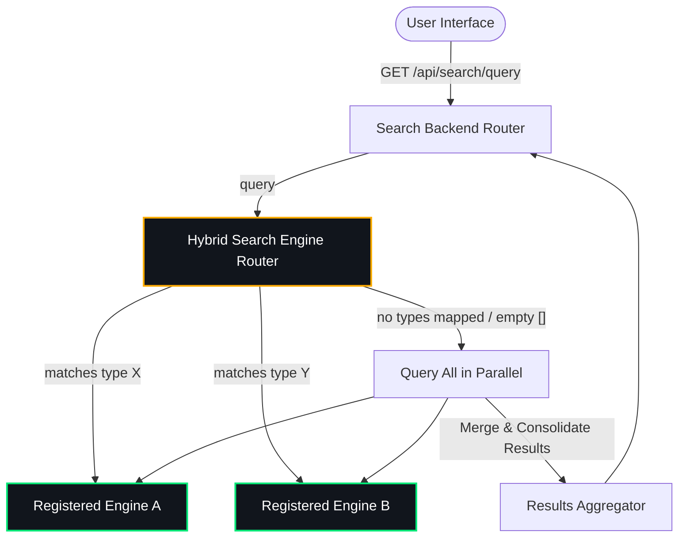

# Hybrid Search Backend Module for Backstage (`@backstage-community/plugin-search-backend-module-hybrid`)

This custom search engine module integrates with the Backstage search system, providing unified routing, parallel execution, and result consolidation across multiple indices and backends.

It acts as a **dynamic orchestrator** that delegates query routing and indexer streams to specialized sub-engines registered via its extension point.

---

## 🏛️ Architecture & Routing

The core engine operates a **Hybrid Search Router** that routes queries across registered sub-engines based on the document types (categories) requested, as defined in your configuration.



### Federated Query Routing & Merging Strategies

When no type filter is selected (or when multiple types mapping to different engines are requested), the hybrid engine queries the corresponding search engines in parallel. It then aggregates the multiple result sets into a single unified result list using one of the configurable merging strategies:

#### 1. Round-Robin Interleaving (`interleave` - Default)

In this strategy, the engine sequentially pulls one result from each sub-engine's results list in a round-robin fashion (e.g. Engine A result `0`, Engine B result `0`, Engine A result `1`, Engine B result `1`...).

- **When to use**: Best when engines search completely different scopes (e.g., catalog entities vs documentation pages) and you want to ensure results from all categories get equal visual presence on the first page, regardless of the scoring scale of each backend.

#### 2. Relative Score Normalization (`score-normalized-sort`)

Sub-engines often output match relevance scores on entirely different scales (for example, Typesense scores can be in the hundreds, whereas Vertex AI Search returns values between `0.0` and `1.0`).
To sort these results together fairly, this strategy normalizes the scores of each engine's response relative to the maximum score in that specific response:
$$score_{normalized} = \frac{score_{raw}}{score_{max\_in\_set}}$$

- If a document does not contain a relevance score, it is assigned a fallback score based on its rank (position) in its engine's original results to preserve its order.
- Finally, all results are merged and sorted by their `score_normalized` descending.
- **When to use**: Best when you want to prioritize the most relevant results across all backends. This ensures that a highly confident documentation match from Vertex AI appears above a lower-confidence catalog match from Typesense, even if their raw scores cannot be compared directly.

> [!IMPORTANT] > **Enforcing Page Limits & Pagination Behaviors**:
>
> - **Single-Engine Routing (Full Pagination)**: If a query maps exclusively to a single registered sub-engine (for example, when a developer is browsing a specialized tab like "Documentation" or "Services"), the router forwards the entire query directly. Any pagination cursor returned by that sub-engine is passed straight back to the client, enabling **100% native, deep pagination**.
> - **Multi-Engine Routing (Capped Page 1 Results)**: If a search query is federated in parallel across multiple engines (e.g. global search), each engine independently returns its top `pageLimit` results. To prevent a bloated payload (which would contain up to `N * pageLimit` items), the router consolidates the result sets, **slices the consolidated array** to respect the client's `pageLimit`, and returns the results **without a pagination `cursor`**.
> - **The Reason**: Pagination cursors are engine-specific and cannot be merged or offset-aligned across completely separate search backends (like Typesense and Vertex AI Search) once their results have been interleaved or sorted together. Capping federated results to a single page is a standard search design pattern: developers get top-relevance blended matches globally on page 1, and click specialized scoped tabs (which invoke the single-engine path) to browse deeper.

---

## 🔌 Installation

First, install the package in your Backstage backend package:

```bash
yarn --cwd packages/backend add @backstage-community/plugin-search-backend-module-hybrid
```

Then, add it to your `packages/backend/src/index.ts` alongside any other plugins/modules:

```typescript
// packages/backend/src/index.ts
import { createBackend } from '@backstage/backend-defaults';

const backend = createBackend();

// ... other plugins ...

backend.add(import('@backstage-community/plugin-search-backend-module-hybrid'));

backend.start();
```

---

## ⚙️ Configuration

The full configuration is defined in your `app-config.yaml`. Under the `hybrid.routing` block, specify which engine name handles which document type, and configure the credentials and parameters for the sub-engines:

```yaml
search:
  engines:
    hybrid:
      # Options: 'interleave' (default round-robin) or 'score-normalized-sort'
      mergeStrategy: score-normalized-sort
      routing:
        software-catalog: typesense
        techdocs: vertexai
        default: typesense # Fallback engine for types without explicit mapping
    typesense:
      apiKey: ${typesenseApiKey}
      nodes:
        - host: localhost
          port: 8108
          protocol: http
      # Additional raw options passed straight to the Typesense Client
      clientOptions:
        connectionTimeoutSeconds: 5
        numRetries: 3
        logLevel: info
      # Customizable schemas and query parameters per collection
      collections:
        software-catalog:
          fields:
            - name: '.*'
              type: 'auto'
            - name: 'embedding'
              type: 'float[]'
              num_dim: 384
              model_config:
                model_name: 'ts/all-MiniLM-L6-v2' # Optional vector search model config
          searchOptions:
            query_by: 'title,text,location,embedding'
    vertexai:
      types:
        techdocs:
          datastore:
            projectId: ${projectId}
            datastoreId: ${dataStoreId}
            location: ${location}
          # Optional: Search App Engine ID. If specified, queries will target the Engine serving config
          # rather than the standalone data store serving config, enabling advanced search features.
          engine:
            projectId: ${projectId}
            engineId: ${engineId}
            location: ${location}
      # Configurable catalog cleanup task
      cleanup:
        enabled: true
        frequency: { hours: 2 }

techdocs:
  publisher:
    googleGcs:
      bucketName: my-techdocs-bucket
```

---

## 🔌 Extension Point: `hybridSearchEngineRegistryExtensionPoint`

Other backend modules can register their search engine implementations to the hybrid search router during their `init` phase.

> [!NOTE]
>
> - **If you are only using the pre-built sub-engines (Typesense / Vertex AI)**: You do not need to write this code. These modules are already fully implemented, and you only need to import them in your Backstage instance.
> - **If you want to integrate a different search engine (e.g., Elasticsearch, Pg, etc.)**: You will need to implement a custom backend module following these examples to register your engine instance with the `hybridSearchEngineRegistryExtensionPoint`.

### Concrete Examples

#### 1. Typesense Module Registration

```typescript
import { hybridSearchEngineRegistryExtensionPoint } from '@backstage-community/plugin-search-backend-module-hybrid';
import { TypesenseSearchEngine } from './TypesenseSearchEngine';

export const searchModuleTypesenseSearch = createBackendModule({
  pluginId: 'search',
  moduleId: 'typesense-search',
  register(env) {
    env.registerInit({
      deps: {
        hybridRegistry: hybridSearchEngineRegistryExtensionPoint,
        config: coreServices.rootConfig,
        logger: coreServices.logger,
      },
      async init({ hybridRegistry, config, logger }) {
        const typesenseSearchEngine = new TypesenseSearchEngine({ ... });

        hybridRegistry.registerEngine('typesense', typesenseSearchEngine, {
          supportsTypes: ['software-catalog'],
        });
      },
    });
  },
});
```

#### 2. Vertex AI Search Module Registration

```typescript
import { hybridSearchEngineRegistryExtensionPoint } from '@backstage-community/plugin-search-backend-module-hybrid';
import { VertexAISearchEngine } from './VertexAISearchEngine';

export const searchModuleVertexAISearch = createBackendModule({
  pluginId: 'search',
  moduleId: 'vertexai-search',
  register(env) {
    env.registerInit({
      deps: {
        hybridRegistry: hybridSearchEngineRegistryExtensionPoint,
        config: coreServices.rootConfig,
        logger: coreServices.logger,
      },
      async init({ hybridRegistry, config, logger }) {
        const vertexAiSearchEngine = new VertexAISearchEngine({ ... });

        hybridRegistry.registerEngine('vertexai', vertexAiSearchEngine, {
          supportsTypes: ['techdocs'],
        });
      },
    });
  },
});
```
