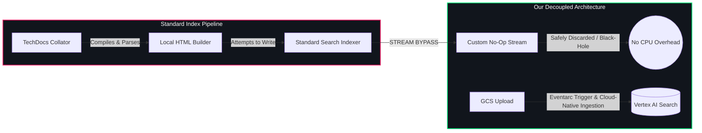

# Vertex AI Search Backend Module for Backstage (`@backstage-community/plugin-search-backend-module-vertexai`)

This backend module integrates Google Cloud Vertex AI Search capabilities into the Backstage Search system. It can be deployed as your **primary, standalone Backstage Search Engine**, or integrated seamlessly as a module under the **`@backstage-community/plugin-search-backend-module-hybrid` router** to handle high-performance semantic queries alongside other engines.

## 🌟 Core Features

- 🔍 **Decoupled Semantic Querying**: Routes Backstage search requests directly to Vertex AI Search Apps and Data Stores, utilizing Google's advanced semantic vector search, spellcheck, autocomplete, and generative AI answers.
- ⚡ **Direct Local Indexing (Optional)**: Provides a high-performance, buffered memory streaming writer (`VertexAIWritableStream`) that allows standard Backstage collators to stream and index documents directly into Vertex AI.
- 🔀 **Infinite Custom Type Extensibility**: Zero hardcoding! You can dynamically map **any custom Backstage document type** (e.g., `techdocs`, `software-catalog`, `apis`, `qa`, or custom plugins) to its own dedicated Google Cloud Data Store and Search App via simple `app-config.yaml` declarations.
- 🧹 **Automated Catalog Cleanup Sweeper**: Runs an automated background sweeper to prune orphaned documentation assets from Google Cloud Storage (GCS) and Vertex AI Search when catalog entities are deleted.
  > [!IMPORTANT] > **Sweeper Ingestion Dependency**: The cleanup sweeper task is **only registered and active when direct local indexing is disabled (`indexing.enabled = false`)**. If local indexing is enabled, catalog synchronization and deletions are handled by standard Backstage collator schedules, making the background sweeper redundant.
  >
  > **Startup Delay**: To prevent race conditions where active files are purged during startup before the catalog has finished bootstrapping, the sweeper incorporates an **initial startup delay (defaults to 2 minutes)** before starting its first sweep.

---

## 🏛️ Ingestion Bypass & Cloud-Native Indexing

In standard Backstage setups, TechDocs are parsed and indexed locally by the Node.js server. This creates massive memory and CPU overhead. Our architecture decouples query routing from ingestion:



1. **Bypass Stream**: The standard indexer returns a throwaway no-op stream, bypassing local document parsing and indexing.
2. **Decoupled Ingestion**: Documentation builds publish a unified `search_index.json` manifest to GCS. This upload triggers an Eventarc webhook that parses the manifest and imports/syncs pages to the Vertex AI Search data store (see the [gcs-eventarc plugin](../events-backend-module-gcs-eventarc/README.md)).
3. **Semantic Querying**: Queries route directly to the structured Vertex AI Search data store, returning relevant documents based on semantic query intent.

---

## 🔗 Required Integration Dependencies

To use this module successfully, your Backstage setup must configure two areas: **App Settings** and **Companion Plugins**.

### 1. ⚙️ Configuration Settings (`app-config.yaml`)

| Setting                                                           | Required Value           | Purpose                                                                                                                                              |
| :---------------------------------------------------------------- | :----------------------- | :--------------------------------------------------------------------------------------------------------------------------------------------------- |
| **Publisher Type** <br>`techdocs.publisher.type`                  | `googleGcs`              | Vertex AI Search reads your documentation index directly from **Google Cloud Storage (GCS)**. Local or other publisher settings will block indexing. |
| **GCS Bucket Name** <br>`techdocs.publisher.googleGcs.bucketName` | _(your-techdocs-bucket)_ | Used by the background sweeper to scan for and purge orphaned static HTML folders when catalog entities are deleted.                                 |

### 2. 📦 Code & Package Dependencies (`package.json`)

| Package / Module                                                     | Role              | Action / Impact                                                                                                                           |
| :------------------------------------------------------------------- | :---------------- | :---------------------------------------------------------------------------------------------------------------------------------------- |
| **`@backstage/plugin-search-backend-module-techdocs`**               | Standard Collator | **Intercepted**: We redirect its indexing stream to a **No-Op Bypass**, eliminating Node.js CPU/memory overhead from parsing static HTML. |
| **`@backstage-community/plugin-events-backend-module-gcs-eventarc`** | Ingestion Webhook | **Required**: Listens to Eventarc file upload triggers on GCS to sync updated pages directly to the Vertex AI Search data store.          |

---

## 🔌 Installation

First, install the package in your Backstage backend package:

```bash
yarn --cwd packages/backend add @backstage-community/plugin-search-backend-module-vertexai
```

This package exports two backend modules depending on your search architecture:

### 1. Standalone Search Engine Setup

If you want Vertex AI Search to act as the primary, standalone search engine for your entire Backstage portal (default export):

```typescript
// packages/backend/src/index.ts
import { createBackend } from '@backstage/backend-defaults';

const backend = createBackend();

// Registers Vertex AI directly as the primary search engine (default export)
backend.add(
  import('@backstage-community/plugin-search-backend-module-vertexai'),
);

backend.start();
```

### 2. Hybrid Search Engine Router Setup

If you are running the custom Hybrid Search Router (routing queries to different engines like Typesense for catalog and Vertex AI for techdocs in parallel), you must register the hybrid named export:

```typescript
// packages/backend/src/index.ts
import { createBackend } from '@backstage/backend-defaults';

const backend = createBackend();

// 1. Add the Hybrid Search router orchestrator
backend.add(import('@backstage-community/plugin-search-backend-module-hybrid'));

// 2. Add Vertex AI registered to the hybrid search registry
backend.add(
  import('@backstage-community/plugin-search-backend-module-vertexai/hybrid'),
);

// 3. Add Typesense registered to the hybrid search registry
backend.add(
  import('@backstage-community/plugin-search-backend-module-typesense/hybrid'),
);

backend.start();
```

---

## 🔍 Extractive Content & Snippet Priority

When displaying search previews, this engine translates Vertex AI's response structures into the Backstage `text` field using a priority-ordered extraction hierarchy. This ensures the user is presented with the most precise direct answers first, falling back to surrounding context paragraphs and snippets:

1. **Extractive Answers** (Highest Priority): Direct, precise sentences answering natural language queries (e.g. `"The default port is 7007."`). Multiple answers are joined using spaces (`' '`) to read as a clean paragraph.
2. **Extractive Segments** (Medium Priority): Surround-context paragraphs containing the match. Multiple segments from non-contiguous parts of the document are joined with newlines and ellipses (`\n...\n`) to visually distinguish the excerpts.
3. **Snippets** (Lowest Priority): Simple keyword-matched fragments containing the highlighted search terms.
4. **Fallback Text**: The raw, full body text of the indexed document page.

### ⚙️ How to Enable in `app-config.yaml`

To leverage **Extractive Answers** and **Segments**, you must ensure your Vertex AI Search Engine is upgraded to the **Enterprise Edition** tier in Google Cloud, and add the `extractiveContentSpec` block inside `searchOptions` in your config:

```yaml
search:
  engines:
    vertexai:
      types:
        techdocs:
          datastore:
            projectId: ${projectId}
            datastoreId: ${dataStoreId}
            location: ${location}
          engine:
            projectId: ${projectId}
            engineId: ${engineId}
            location: ${location}
          searchOptions:
            contentSearchSpec:
              extractiveContentSpec:
                maxExtractiveAnswerCount: 1
                maxExtractiveSegmentCount: 2
              snippetSpec:
                maxSnippetCount: 1
```

---

## ⚙️ Configuration

Configure the Google Cloud Vertex AI Search settings in your `app-config.yaml`. By default, local indexing is bypassed (returning a no-op stream to avoid CPU/memory overhead on your Node server). You can optionally enable direct local indexing (useful for streaming database assets like Catalog entities directly to Vertex AI Search).

> [!IMPORTANT] > **Catalog Indexing Force-Enabled**:
> The `software-catalog` document type represents a highly dynamic metadata store that requires synchronization with the search index. Therefore, local indexing for the `software-catalog` type is **mandatory** and **always enabled** in the code. Any configuration that attempts to disable it (either globally via `indexing.enabled: false` or specifically under `types.software-catalog.indexing.enabled: false`) will be **ignored**, and a log message will be output during backend initialization indicating that it has been overridden to enabled.

### 🏛️ The `blendedSearch` Config Block

The `blendedSearch` configuration block determines how Vertex AI Search queries multiple datastores simultaneously. All three keys are **mandatory** inside this block:

- **`projectId`** (string): The Google Cloud Project ID where the global blended search app is located.
- **`location`** (string): The geographic region/location of the global blended search app (e.g., `global`, `europe-west4`).
- **`engineId`** (string): The global blended search App Engine ID.

> [!WARNING] > **Blended Search Conflict in Hybrid Setup**:
> You must **only** configure `blendedSearch` if you are using Vertex AI Search in **Standalone** mode.
>
> In a **Hybrid Search Router** setup, if routing delegates types to other engines (e.g., techdocs to Vertex AI and catalog to Typesense), the global query blending is managed by the Backstage Hybrid Search Router itself. Specifying `blendedSearch` concurrently in Hybrid mode will trigger a startup configuration conflict error.

> [!NOTE] > **No Relevance Scores in Blended App Response**:
> When querying a global `blendedSearch` App (via `engineId`), the Google Cloud Discovery Engine API merges results from all underlying datastores but does not return a unified `relevanceScore` in the response hits. As a result, the `score` field in the final search results will be returned as `null` or `undefined` for all blended matches. In contrast, querying individual datastores directly (e.g., searching a single type) returns their respective numerical scores.

---

### 1. Standalone Search Engine Configuration

Use this if Vertex AI Search is the **primary, sole search engine** for your Backstage portal. It **requires** `blendedSearch` so that global homepage searches query all datastores in parallel:

```yaml
search:
  engine: vertexai
  engines:
    vertexai:
      # MANDATORY: Global blended Search App for homepage queries
      blendedSearch:
        projectId: company-portal-prod
        location: europe-west4
        engineId: backstage-global-search-app
        # Optional raw search query configurations (e.g., extractive content options)
        searchOptions:
          contentSearchSpec:
            extractiveContentSpec:
              maxExtractiveAnswerCount: 1
              maxExtractiveSegmentCount: 2
            snippetSpec:
              maxSnippetCount: 1

      # Optional: Global default for direct local indexing streams
      indexing:
        enabled: true

      # Unified, structured types mapping! Controls both ingestion (datastore) and serving (engine).
      types:
        techdocs:
          datastore:
            projectId: company-core-prod
            datastoreId: backstage-techdocs
            location: europe-west4
          # Optional: Dedicated serving Engine App for techdocs-specific queries (falls back to datastore if omitted)
        software-catalog:
          datastore:
            projectId: company-catalog-prod
            datastoreId: backstage-catalog
            location: europe-west4
          # Inherits global default (indexing.enabled: true)

      # Configurable catalog cleanup task
      cleanup:
        enabled: true
        frequency: { hours: 2 } # optional, defaults to 2 hours
        initialDelay: { minutes: 2 } # optional, defaults to 2 minutes (avoids race conditions during catalog bootstrap)

techdocs:
  publisher:
    googleGcs:
      bucketName: my-techdocs-bucket
```

---

### 2. Hybrid Search Engine Configuration

Use this if you are using the **Hybrid Search Router** and delegating different index types to different engines (e.g., `techdocs` to `vertexai` and `software-catalog` to `typesense`).

Notice that **`blendedSearch` is omitted** because query blending is managed by the Hybrid Search Router, and Vertex AI Search must query its type-specific datastore directly:

```yaml
search:
  engine: hybrid
  engines:
    hybrid:
      routing:
        techdocs: vertexai
        software-catalog: typesense
        default: typesense
    vertexai:
      # Unified, structured types mapping! Controls both ingestion (datastore) and serving (engine).
      types:
        techdocs:
          datastore:
            projectId: company-core-prod
            datastoreId: backstage-techdocs
            location: europe-west4
          # Omit engine config because TechDocs datastore is queried directly, or map to a dedicated techdocs engine:
          engine:
            projectId: company-portal-prod
            engineId: backstage-techdocs-app
            location: europe-west4
          # Disable local indexing for TechDocs because it is indexed via Eventarc
          indexing:
            enabled: false

      cleanup:
        enabled: true
        frequency: { hours: 2 }
        initialDelay: { minutes: 2 }

techdocs:
  publisher:
    googleGcs:
      bucketName: my-techdocs-bucket
```

---

## 🚀 Bulk-Bootstrapping Existing TechDocs (`bootstrap.ts`)

If you are migrating an existing Backstage instance to Vertex AI Search, you may already have hundreds of generated TechDocs stored in your Google Cloud Storage bucket. You can run the provided CLI bootstrap script to bulk-import all of your existing documentation into your new Vertex AI Search Datastore.

The script runs in two steps:

1. **`prepare-docs`**: Scans the source TechDocs GCS bucket for `search_index.json` files, downloads/parses them, fetches metadata from the running Backstage catalog API to enrich the documents with owner/lifecycle annotations, maps them to the required Vertex AI structured schema, and uploads them to a staging GCS bucket as `.ndjson` files.
2. **`import-docs`**: Batches and imports those staging `.ndjson` files into the Vertex AI Search Datastore using the GCP Discovery Engine API.

> [!IMPORTANT] > **Staging GCS Bucket Requirement**:
> Before running the script, you **must create a separate, empty Google Cloud Storage bucket** (e.g., `your-temporary-staging-gcs-bucket`) to serve as a staging area. The script outputs flat structured NDJSON files into this bucket, which are subsequently read by the Discovery Engine API during the import step.

### How to Run:

#### 1. Prepare Staging Files

Run the preparation command, pointing it to your source TechDocs bucket, a staging bucket, and your running Backstage API (to query catalog metadata):

```bash
npx ts-node plugins/search-backend-module-vertexai/scripts/bootstrap.ts prepare-docs \
  --techdocsBucket <your-techdocs-gcs-bucket> \
  --stagingBucket <your-temporary-staging-gcs-bucket> \
  --backstageUrl <http://localhost:7007 or your-backstage-endpoint>
```

#### 2. Trigger Vertex AI Import

Import the staging files directly into your Vertex AI Datastore. The script automatically chunks the import requests into batches of 100 files to avoid Discovery Engine limits:

```bash
npx ts-node plugins/search-backend-module-vertexai/scripts/bootstrap.ts import-docs \
  --projectId <your-gcp-project-id> \
  --location <eu or global> \
  --datastoreId <your-techdocs-datastore-id> \
  --stagingBucket <your-temporary-staging-gcs-bucket>
```

---

## 🛠️ Infrastructure Provisioning (Terraform)

To run Vertex AI Search, you must provision **one separate Data Store** for each Backstage document type (e.g., one for `software-catalog`, one for `techdocs`, etc.). For global portal-wide searches, you link all of these Data Stores to a **single global blended Search App**. Optionally, you can also provision **additional dedicated Search Apps** for individual Data Stores to support custom search configs and query tuning for specific types.

### ❓ Why a Multi-Datastore Blended App?

This architecture provides four major benefits:

1. **Isolated Search Tuning**: Allows you to customize search settings and behavior differently in every Data Store.
2. **Unified Search Results**: By linking all Data Stores to a single **Search App**, Google's AI engine automatically merges and ranks search results from all collections in parallel, returning one beautifully blended list to the Backstage portal.
3. **Isolated Schemas**: Keeps schemas clean and separate for each document type, avoiding mixing unrelated fields in a single index.
4. **Geographical Flexibility**: You can house different Data Stores in different geographic regions (e.g. storing EU catalog data in Europe and US docs in the US) while still querying both from a single global app.

To make provisioning and maintenance effortless, we leverage **Semi-Dynamic Schema Auto-Discovery**:

- We explicitly define the core **`title`** and **`text`** (description) key property mappings in our schemas to ensure optimal search relevancy.
- **Filtering Fields Requirement**: Any fields that you intend to use in query filters (such as `kind`, `namespace`, `location`, `owner`, `lifecycle`, or `componentType`) **must be explicitly declared in the schema properties block and marked as `"indexable": true`**.
- We set **`"dynamic": "true"`** in the JSON schema properties, which instructs Google Cloud to **automatically discover and store any other metadata fields** (like custom annotations or integrations) on-the-fly when documents are ingested!

### 📄 Standalone Semi-Dynamic JSON Schema

This JSON Schema blueprint serves as a template for your **TechDocs** and **Software Catalog** Data Stores. For other custom document types, you must keep the core `title` and `text` properties (mapped for search relevance), and determine which additional fields will be used in your query filters to declare them explicitly as both `"indexable": true` and `"retrievable": true`.

```json
{
  "$schema": "https://json-schema.org/draft/2020-12/schema",
  "type": "object",
  "dynamic": "true",
  "properties": {
    "title": {
      "type": "string",
      "keyPropertyMapping": "title",
      "retrievable": true
    },
    "text": {
      "type": "string",
      "keyPropertyMapping": "description",
      "retrievable": true
    },
    "kind": {
      "type": "string",
      "indexable": true,
      "retrievable": true
    },
    "namespace": {
      "type": "string",
      "indexable": true,
      "retrievable": true
    },
    "location": {
      "type": "string",
      "indexable": true,
      "retrievable": true
    },
    "owner": {
      "type": "string",
      "indexable": true,
      "retrievable": true
    },
    "lifecycle": {
      "type": "string",
      "indexable": true,
      "retrievable": true
    },
    "componentType": {
      "type": "string",
      "indexable": true,
      "retrievable": true
    }
  }
}
```

### 🔑 Required Google Cloud APIs

Before provisioning, ensure the following service APIs are enabled on your GCP project:

- **`discoveryengine.googleapis.com`** (Vertex AI Agent Builder / Search API)
- **`cloudresourcemanager.googleapis.com`** (Cloud Resource Manager API, required for IAM policy configuration)

### 📄 Terraform Resource Blueprint

Use the following Terraform manifest to provision your multi-datastore blended Search App:

```hcl
locals {
  # Define all Backstage document categories/types you wish to index in your portal
  datastores = {
    techdocs = {
      display_name         = "Backstage TechDocs Store"
      create_dedicated_app = true  # <--- Triggers a dedicated Search App just for TechDocs!
    }
    catalog = {
      display_name         = "Backstage Catalog Store"
      create_dedicated_app = false # Uses only the global blended Search App
    }
  }
}

# ============================================================================
# 1. DYNAMIC DATA STORES
# ============================================================================

resource "google_discovery_engine_data_store" "backstage" {
  for_each          = local.datastores
  project           = var.project_id
  location          = var.region
  data_store_id     = "backstage-${each.key}"
  display_name      = each.value.display_name
  industry_vertical = "GENERIC"
  content_config    = "NO_CONTENT" # Ingested directly in-memory via JSON
  solution_types    = ["SOLUTION_TYPE_SEARCH"]
}

# ============================================================================
# 2. SEMI-DYNAMIC SCHEMAS (Auto-Discovery Enabled)
# ============================================================================

resource "google_discovery_engine_schema" "backstage_schema" {
  for_each      = local.datastores
  project       = var.project_id
  location      = google_discovery_engine_data_store.backstage[each.key].location
  data_store_id = google_discovery_engine_data_store.backstage[each.key].data_store_id
  schema_id     = "default_schema"

  # Standardized schema template for TechDocs and Software Catalog (explicitly maps core & filterable fields)
  json_schema = jsonencode({
    "$schema": "https://json-schema.org/draft/2020-12/schema",
    "type": "object",
    "dynamic": "true",
    "properties": {
      "title":         { "type": "string", "keyPropertyMapping": "title", "retrievable": true },
      "text":          { "type": "string", "keyPropertyMapping": "description", "retrievable": true },
      "kind":          { "type": "string", "indexable": true, "retrievable": true },
      "namespace":     { "type": "string", "indexable": true, "retrievable": true },
      "location":      { "type": "string", "indexable": true, "retrievable": true },
      "owner":         { "type": "string", "indexable": true, "retrievable": true },
      "lifecycle":     { "type": "string", "indexable": true, "retrievable": true },
      "componentType": { "type": "string", "indexable": true, "retrievable": true }
    }
  })
}

# ============================================================================
# 3. OPTIONAL DEDICATED SEARCH APPS (Per Data Store)
# ============================================================================

resource "google_discovery_engine_app" "dedicated" {
  # Filters the datastores map to only loop over those that explicitly requested a dedicated app!
  for_each          = { for k, v in local.datastores : k => v if lookup(v, "create_dedicated_app", false) }
  project           = var.project_id
  location          = var.region
  collection_id     = "default_collection"
  app_id            = "backstage-${each.key}-search"
  display_name      = "Backstage ${each.value.display_name} App"
  industry_vertical = "GENERIC"
  solution_type     = "SOLUTION_TYPE_SEARCH"

  # Links ONLY the corresponding Data Store to this dedicated Search App
  data_store_ids    = [google_discovery_engine_data_store.backstage[each.key].data_store_id]
}

# ============================================================================
# 4. GLOBAL BLENDED SEARCH APP (Linking All Data Stores)
# ============================================================================

resource "google_discovery_engine_app" "backstage_search" {
  project           = var.project_id
  location          = var.region
  collection_id     = "default_collection"
  app_id            = "backstage-search"
  display_name      = "Backstage Global Search App"
  industry_vertical = "GENERIC"
  solution_type     = "SOLUTION_TYPE_SEARCH"

  # Automatically resolves and links all dynamically provisioned Data Stores
  data_store_ids    = [for ds in google_discovery_engine_data_store.backstage : ds.data_store_id]
}
```

> [!IMPORTANT] > **GCP Service Account IAM Requirements**:
> The Service Account used by your Backstage backend must have:
>
> 1. **`roles/discoveryengine.admin`** on the GCP project or Discovery Engine resource. _(Note: Admin permission is strictly required; lower-tier editor/viewer roles will fail to purge/delete indexed documents)._
> 2. **`roles/storage.objectAdmin`** on the TechDocs GCS bucket to scan for and delete orphaned static folders.
